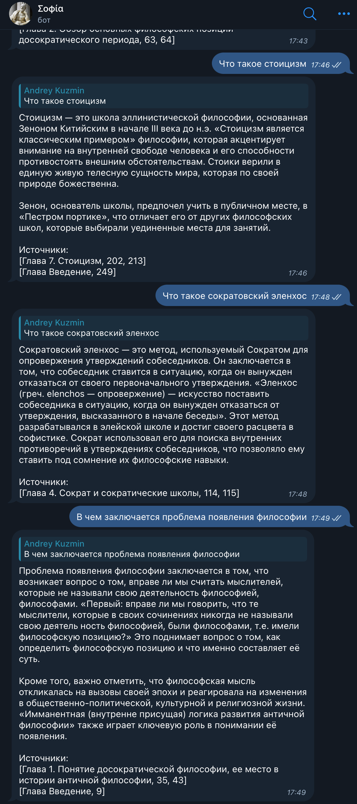
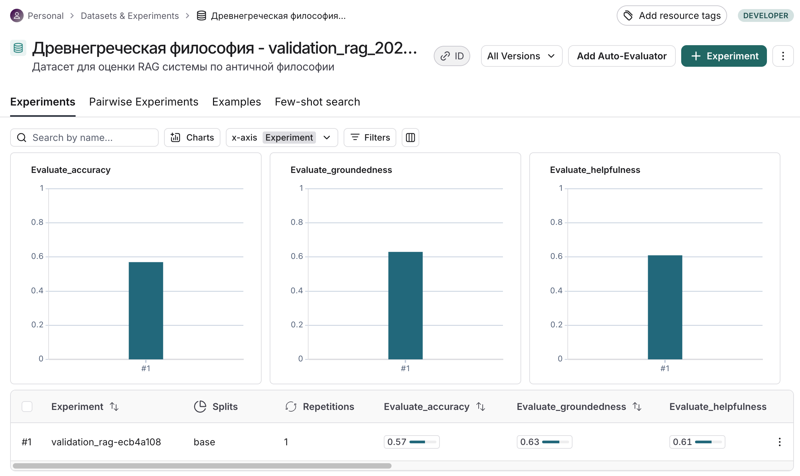

# 📚 RAG Telegram Bot для книги по истории философии

[](https://www.python.org/)
[](https://langchain.com/)
[](https://opensource.org/licenses/MIT)

_Умный ассистент для ответов на вопросы по книге с использованием технологии RAG_



## 🌟 Описание

Telegram-бот с технологией RAG (Retrieval-Augmented Generation) для интеллектуальных ответов по книге по истории философии. Сочетает мощь векторного поиска FAISS и генерацию контекста с помощью OpenAI GPT-4o-mini.

## 🚀 Возможности

* 🔍 Семантический поиск по тексту книги
* 💬 Генерация контекстно-зависимых ответов с цитатами
* 🇷🇺 Поддержка русского языка
* 📊 Точное указание источников (глава и страница)
* ⚡ Оптимизированная производительность
* 📁 Кеширование векторных представлений

## 🛠 Технологический стек

| Компонент       | Технология                      |
| --------------- | ------------------------------- |
| NLP Framework   | LangChain, LangSmith            |
| LLM             | GPT-4o-mini через ProxyAPI      |
| Vector Store    | FAISS                           |
| Document Parser | Unstructured                    |
| API Gateway     | Python Telegram Bot             |
| Environment     | Python 3.9+, Poetry, Virtualenv |

## 📦 Быстрый старт

### ⚙️ Предварительные требования

* Получить Telegram токен у @BotFather
* Зарегистрировать OpenAI API ключ
* Установить Python 3.9+

### 🛠 Установка

```bash
# Клонировать репозиторий
git clone https://github.com/kuzmean/rag-book.git
cd rag-book

# Создать виртуальное окружение
python -m venv .venv
source .venv/bin/activate  # Linux/MacOS
# или .venv\Scripts\activate  # Windows

# Установить зависимости
pip install -r requirements.txt
```

### ⚡ Конфигурация

Создать файл `.env` в корне проекта:

```
TELEGRAM_TOKEN=ваш_telegram_токен
OPENAI_API_KEY=ваш_openai_ключ
```

Поместить PDF-книгу в папку `docs/`

### 🖥 Запуск системы

```bash
# Обработка документа и создание эмбеддингов
python src/document_processor.py

# Запуск Telegram бота
python src/main.py
```

## 🏗 Архитектура системы

Система использует архитектуру RAG (Retrieval-Augmented Generation):

1. **Обработка документов**: PDF-книга разбивается на фрагменты с метаданными
2. **Векторизация**: Создание эмбеддингов для каждого фрагмента
3. **Поиск**: Семантический поиск релевантных фрагментов по запросу пользователя
4. **Генерация**: Формирование ответа с использованием найденного контекста
5. **Цитирование**: Автоматическое добавление ссылок на источники

## �� Структура проекта

```
project-root/
├── docs/                   # Исходные PDF-документы
├── embeddings/             # Кеш векторных представлений
├── screenshots/            # Скриншоты работы системы
├── src/
│   ├── bot.py              # Логика Telegram бота
│   ├── config.py           # Управление конфигурацией
│   ├── document_processor.py # Пайплайн обработки PDF
│   ├── main.py             # Точка входа
│   └── rag_system.py       # Ядро RAG системы
├── validation/             # Скрипты для валидации системы
│   ├── langsmith_experiment.py  # Валидация системы
│   ├── evaluation_results.json  # Тестовый датасет
├── .env.example            # Шаблон переменных окружения
├── LICENSE                 # Лицензия MIT
├── README.md               # Документация
└── requirements.txt        # Зависимости Python
```

## 📊 Валидация системы

Валидация системы проводилась на сгенерированном датасете с 21 примером вопросов и ответов. Результаты оценки качества ответов представлены на скриншоте:



## 💡 Примеры использования

### Пример 1: Знание и искусство у Аристотеля

**Пользователь:**
```
Почему Аристотель считает что знание в большей мере относится к искусству, нежели чем к опыту?
```

**Бот:**
```
Аристотель считает, что знание в большей мере относится к искусству, чем к опыту, потому что искусство связано со знанием причин. Он утверждает, что «имеющие опыт знают «что», но не знают «почему», владеющие же искусством знают «почему», т.е. знают причину». Это различие подчеркивает, что мудрость (sophia) связана не с умением действовать, а с обладанием теоретическим знанием и знанием причин. 

Кроме того, Аристотель отмечает, что «опыт ориентирован на единичное, а искусство — на общее», что также указывает на более высокую ценность искусства в контексте познания.

Источники:
[Глава 6. Аристотель и Ликей, 158, 160, 161]
```

### Пример 2: Понятие лишенности

**Пользователь:**
```
Объясни понятие лишенности у Аристотеля
```

**Бот:**
```
Понятие лишенности у Аристотеля связано с материей и формой. Он утверждает, что «лишенность — это не просто отсутствие формы, но еще и возможность формы». Это означает, что лишенность не является просто пустотой или небытием, а представляет собой потенциал для обретения формы. Аристотель также подчеркивает, что «материя не сводится к лишенности, к небытию (to те on), в противном случае она не смогла бы обрести форму». Таким образом, лишенность играет важную роль в понимании материи и ее качественной различности.

Источники:
[Глава 6. Аристотель и Ликей, 163, 166]
```

### Пример 3: Пифагор

**Пользователь:**
```
Расскажи про Пифагора
```

**Бот:**
```
Пифагор был выдающимся философом, который, согласно свидетельствам, обладал удивительной осведомленностью о событиях в городе, даже когда, как он утверждал, находился в Аиде. «Все были потрясены и признали Пифагора божественным», что подчеркивает его влияние и авторитет среди современников. Его облик также вызывал восхищение: «он был настолько величественен, что некоторые верили, будто их посетил сам Аполлон». 

Пифагор жил в Кротоне и обустроил себе пещерку, где проводил время в уединении, общаясь только с матерью, которая записывала события, происходившие в городе. Сведения о его смерти также противоречивы, но известно, что он умер в Метапонте.

Источники:
[Глава 2. Обзор основных философских позиций досократического периода, 63, 64]
```

## 🛡 Безопасность

* 🔐 Все ключи хранятся в `.env` (добавьте в `.gitignore`)
* 🔄 Используйте виртуальные окружения
* ⚠️ Не публикуйте API-ключи в открытом доступе

## 📄 Лицензия

Распространяется под лицензией MIT. Подробности в файле LICENSE.

---

Создано с ❤️ для любителей философии и технологий