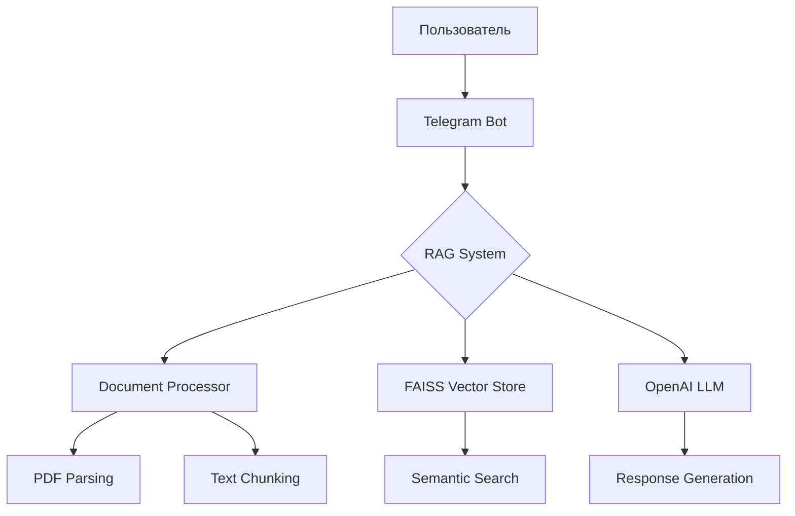

# 📚 RAG Telegram Bot для книги "Горц А. - Нематериальное"


*Умный ассистент для ответов на вопросы по книге с использованием технологии RAG*

<div align="center">
  
</div>

## 🌟 Описание
Telegram-бот с технологией RAG (Retrieval-Augmented Generation) для интеллектуальных ответов по книге Андре Горца. Сочетает мощь векторного поиска FAISS и генерацию контекста с помощью OpenAI GPT-3.5/4.

## 🚀 Возможности
- 🔍 Семантический поиск по тексту книги
- 💬 Генерация контекстно-зависимых ответов
- 🇷🇺 Поддержка русского языка
- ⚡ Оптимизированная производительность
- 📁 Кеширование векторных представлений

## 🛠 Технологический стек
| Компонент       | Технология                          |
|-----------------|-------------------------------------|
| NLP Framework   | LangChain                           |
| LLM             | OpenAI GPT                          |
| Vector Store    | FAISS                               |
| Document Parser | Unstructured                        |
| API Gateway     | Python Telegram Bot                 |
| Environment     | Python 3.9+, Poetry, Virtualenv     |

## 📦 Быстрый старт

### ⚙️ Предварительные требования
- Получить Telegram токен у [@BotFather](https://t.me/BotFather)
- Зарегистрировать [OpenAI API ключ](https://platform.openai.com/)
- Установить Python 3.9+

### 🛠 Установка
```bash
# Клонировать репозиторий
git clone https://github.com/yourusername/rag-bot-gorz.git
cd rag-bot-gorz

# Создать виртуальное окружение
python -m venv .venv
source .venv/bin/activate  # Linux/MacOS
# или .venv\Scripts\activate  # Windows

# Установить зависимости
pip install -r requirements.txt
```

### ⚡ Конфигурация
Создать файл `.env` в корне проекта:

```ini
TELEGRAM_TOKEN=ваш_telegram_токен
OPENAI_API_KEY=ваш_openai_ключ
```

Поместить PDF-книгу в папку `docs/`

### 🖥 Запуск системы
```bash
# Обработка документа и создание эмбеддингов
python src/document_processor.py

# Запуск Telegram бота
python src/main.py
```

## 🗂 Структура проекта
```plaintext
project-root/
├── docs/                   # Исходные PDF-документы
├── embeddings/             # Кеш векторных представлений
├── src/
│   ├── bot.py              # Логика Telegram бота
│   ├── config.py           # Управление конфигурацией
│   ├── document_processor.py # Пайплайн обработки PDF
│   ├── main.py             # Точка входа
│   └── rag_system.py       # Ядро RAG системы
├── .env.example            # Шаблон переменных окружения
├── LICENSE                 # Лицензия MIT
├── README.md               # Документация
└── requirements.txt        # Зависимости Python
```

## 🏗 Архитектура системы


## 💡 Примеры использования
**Пользователь:**
```
/start
```
**Бот:**
```
"Добро пожаловать! Я ваш персональный гид по книге Андре Горца. Задавайте вопросы по содержанию, и я найду ответы в тексте!"
```

**Пользователь:**
```
"Объясни концепцию нематериального труда"
```
**Бот:**
```
"Согласно Горцу, нематериальный труд — это... [генерированный ответ с цитатами из книги]"
```

**Пользователь:**
```
"Какие главы посвящены постфордизму?"
```
**Бот:**
```
"Этой теме посвящены главы 3 и 5. Основные тезисы: ..."
```

## 🛡 Безопасность
- 🔐 Все ключи хранятся в `.env` (добавьте в `.gitignore`)
- 🛡️ Регулярно обновляйте зависимости (`pip audit`)
- 🔄 Используйте виртуальные окружения
- ⚠️ Не публикуйте API-ключи в открытом доступе

## 🤝 Участие в проекте
Приветствуются пулл-реквесты! Порядок действий:
1. Форкните репозиторий
2. Создайте ветку: `git checkout -b feature/your-feature`
3. Закоммитьте изменения: `git commit -m 'Add some feature'`
4. Запушьте в форк: `git push origin feature/your-feature`
5. Откройте Pull Request

## 📄 Лицензия
Распространяется под лицензией MIT. Подробности в файле LICENSE.

<div align="center"> <sub>Создано с ❤️ для любителей философии и технологий</sub> </div>